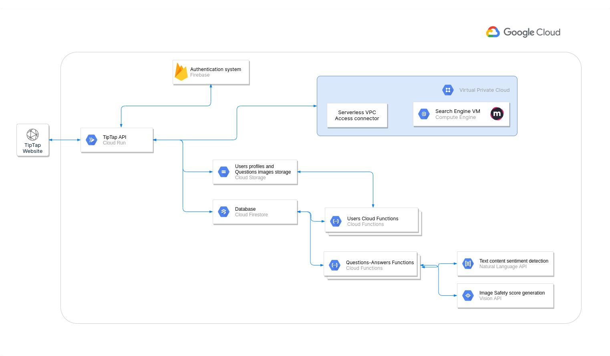
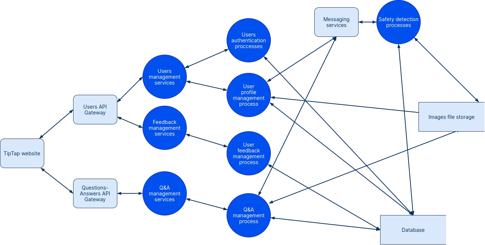

# TipTap Q&A
TipTap is a cloud-based question and answer site where users can post and answer questions. It tends to cover many topics of interest.
TipTap is built on top of Google Cloud Platform using only serverless technologies. It provides a user authentication system , a feedback system and question-and-answer system.

## Tools

- Google Cloud Platform
  - Cloud Functions: event-based functions
  - Cloud Run: containerized API CaaS
  - Cloud Endpoints: API gateway
  - Firebase Authentication: authentication system
  - Cloud Firestore: main database
  - Cloud Storage: images storage
  - Cloud Vision API: images analysis
  - Cloud Natural Language API: questions and responses text analysis
  - Cloud Build: container images building solution
  - Cloud Container Registry: images registry 
  - Cloud Compute Engine: IaaS for hosting search engine
  - Cloud Firewall Rules
- NestJS: NodeJS backend
- Docker
- Terraform
- MeiliSearch: Full-text Search Engine
- VueJs
- Vagrant: local development

## Parts

- backend (NestJs)
- frontend (VueJs)
- infrastructure (terraform)
- local development (vagrant)

## Presentation
Full presentation
[Google Slide](https://docs.google.com/presentation/d/1X27-9_CD9AgdlKWmV7hwE1-oVAcbVnWD-kXUYj3ciTo/edit?usp=sharing)

Architecture

Data Flow Diagram
